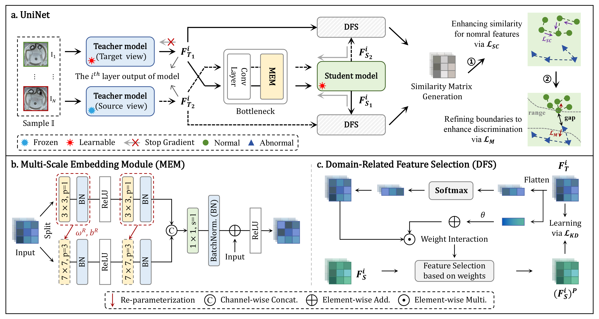
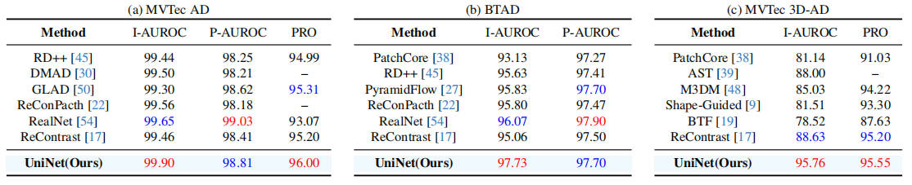
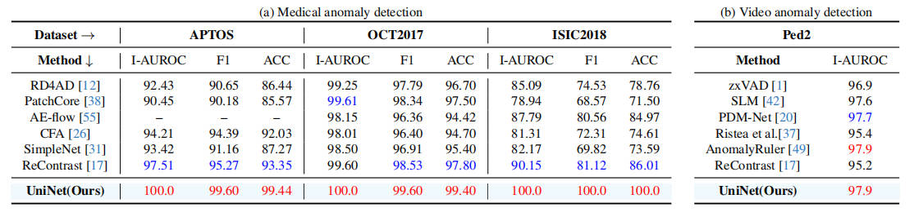
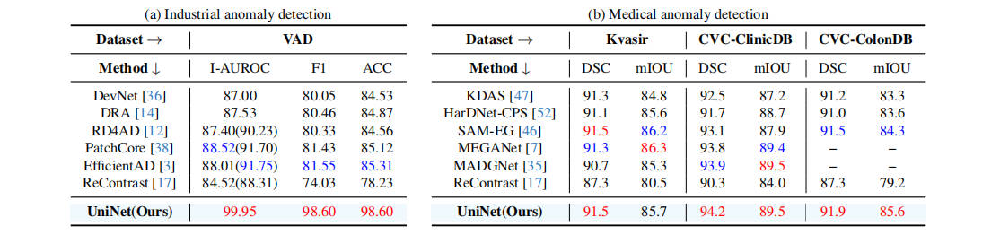
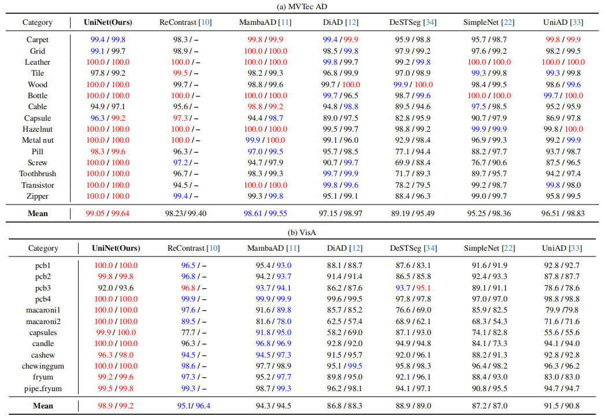
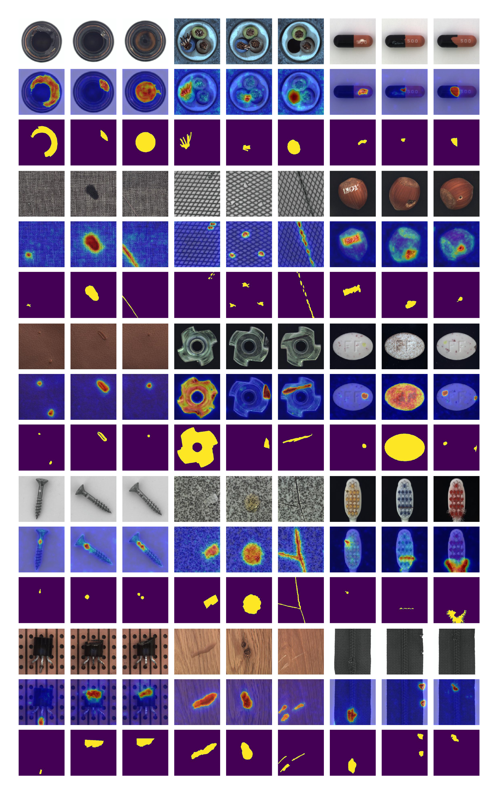
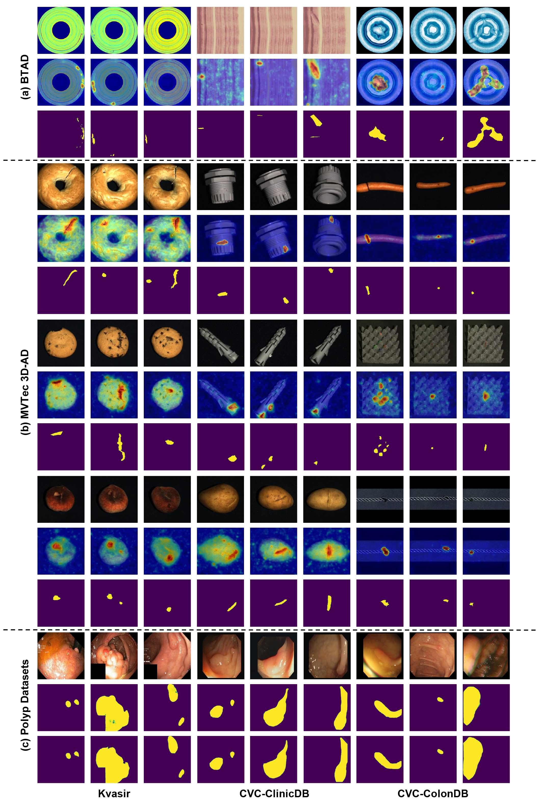

<div align="center">

# 🤖 UniNet: A Contrastive Learning-guided Unified Framework with Feature Selection for Anomaly Detection
### _[**Shun Wei**](https://scholar.google.com/citations?user=FphuySUAAAAJ&hl=zh-CN),&nbsp; [**Jielin Jiang**](https://scholar.google.com/citations?user=NNaMeE0AAAAJ&hl=zh-CN),&nbsp; [**Xiaolong Xu**](https://scholar.google.com/citations?hl=zh-CN&user=Tyzef4sAAAAJ)_
### [-- CVPR 2025 --](https://cvpr.thecvf.com/)

&nbsp;
&nbsp;
&nbsp;
&nbsp;
&nbsp;
[📄 PDF](https://pangdatangtt.github.io/static/pdfs/UniNet__arXix_.pdf) 

</div>

<div align="center">

[](https://paperswithcode.com/sota/anomaly-detection-on-mvtec-ad?p=uninet-a-contrastive-learning-guided-unified) 
[](https://paperswithcode.com/sota/anomaly-detection-on-btad?p=uninet-a-contrastive-learning-guided-unified)
[](https://paperswithcode.com/sota/anomaly-detection-on-mvtec-3d-ad-rgb?p=uninet-a-contrastive-learning-guided-unified)
[](https://paperswithcode.com/sota/anomaly-detection-on-visa?p=uninet-a-contrastive-learning-guided-unified)
[](https://paperswithcode.com/sota/image-classification-on-isic2018?p=uninet-a-contrastive-learning-guided-unified)
[](https://paperswithcode.com/sota/retinal-oct-disease-classification-on-oct2017?p=uninet-a-contrastive-learning-guided-unified)
[](https://paperswithcode.com/sota/anomaly-detection-on-ucsd-ped2?p=uninet-a-contrastive-learning-guided-unified)
[](https://paperswithcode.com/sota/medical-image-segmentation-on-cvc-colondb?p=uninet-a-contrastive-learning-guided-unified)
[](https://paperswithcode.com/sota/medical-image-segmentation-on-cvc-clinicdb?p=uninet-a-contrastive-learning-guided-unified)
</div>




## 🔔 News
- 05-15-2025: Fix some minor errors.
- 04-27-2025: The checkpoints have been uploaded.
- 04-26-2025: The code has been released 😊!
- 04-21-2025: The code will be released in recent days !
- 02-27-2025: Accepted by **CVPR2025** 💥!


## List of TODOs
- [x] 📖 Introduction
- [x] 🔧 Environments
- [x] 📊 Data Preparation
- [x] 🚀 Run Experiments
- [x] 📂 Results
- [x] 🔗 Citation
- [x] 🙏 Acknowledgements
- [x] 📜 License
- [x] 💬 Contact


## 📖 Introduction
This repository will contain source code for UniNet implemented with PyTorch.

UniNet is a unified framework designed for diverse domains, such as industrial, medical, and video, by addressing the limitations in general ability of existing methods.
Besides, UniNet can be suited for both unsupervised and supervised settings simultaneously. As a unified framework, UniNet also focuses on multi-class anomaly detection.

## 🔧 Environments
Create a new conda environment and install required packages.
```
conda create -n uninet_env python=3.9.7
conda activate uninet_env
pip install -r requirements.txt
```
Experiments are conducted on NVIDIA GeForce RTX 3090.
Same GPU and package version are recommended. 

## 📊 Data Preparation
The public datasets employed in the paper are listed below.
- Industrial domain: [MVTec AD](https://www.mvtec.com/company/research/datasets/mvtec-ad/), [VisA](https://github.com/amazon-science/spot-diff/), [BTAD](http://avires.dimi.uniud.it/papers/btad/btad.zip),
[MVTec 3D-AD](https://www.mvtec.com/company/research/datasets/mvtec-3d-ad/downloads), [VAD](https://github.com/abc-125/vad?tab=readme-ov-file).
- Medical domain: [OCT2017](https://data.mendeley.com/datasets/rscbjbr9sj/3), [APTOS](https://www.kaggle.com/competitions/aptos2019-blindness-detection/data), [ISIC2018](https://challenge.isic-archive.com/data/#2018), [Kvasir](https://figshare.com/articles/figure/Polyp_DataSet_zip/21221579), [CVC-ColonDB](https://figshare.com/articles/figure/Polyp_DataSet_zip/21221579), [CVC-ClinicDB](https://figshare.com/articles/figure/Polyp_DataSet_zip/21221579).
- Video domain: [Ped2](http://www.svcl.ucsd.edu/projects/anomaly/dataset.html).

<details>
<summary><strong> 1. MVTec AD</strong></summary>

```
|-- mvtec
    |-- bottle
        |-- ground_truth
        |-- test
        |-- train
    |-- cable
        |-- ground_truth
        |-- test
        |-- train
    |-- ...
```
</details>

<details>
<summary><strong> 2. VisA</strong></summary>

Unzip the file to ```../VisA/.``` Preprocess the dataset to ```../VisA_pytorch/``` in 1-class mode by their official splitting [code](https://github.com/amazon-science/spot-diff). Alternately, 
you can also preprocess the dataset using this [code](https://github.com/guojiajeremy/ReContrast/blob/master/prepare_data/prepare_visa.py) from ReContrast.
```
|-- VisA_pytorch
    |-- 1cls
        |-- candle
            |-- ground_truth
            |-- test
                    |-- good
                    |-- bad
            |-- train
                    |-- good
        |-- capsules
        |-- ....
```
</details>

<details>
<summary><strong> 3. APTOS</strong></summary>

Creat a new directory ```../APTOS```. Unzip the file to ```../APTOS/original/```. Now, the directory would be like:
```
|-- APTOS
    |-- original
        |-- test_images
        |-- train_images
        |-- test.csv
        |-- train.csv
```

Run the following command to preprocess the data to ```../APTOS/```.

```
python ./prepare_data/prepare_aptos.py --data-folder ../APTOS/original --save-folder ../APTOS
```

Then, it woule be like:
```
|-- APTOS
    |-- test
        |-- NORMAL
        |-- ABNORMAL
    |-- train
        |-- NORMAL
    |-- original
```
</details>


<details>
<summary><strong> 4. OCT2017</strong></summary>
    
Creat a new directory ```../OCT2017```. Unzip the file, and move everything in ZhangLabData/CellData/OCT to ```../OCT2017/```. The directory should be like:
```
|-- OCT2017
    |-- test
        |-- CNV
        |-- DME
        |-- DRUSEN
        |-- NORMAL
    |-- train
        |-- CNV
        |-- DME
        |-- DRUSEN
        |-- NORMAL
```
</details>

<details>
<summary><strong> 5. ISIC2018</strong></summary>

Creat a new directory ```../ISIC2018```. After downloading "Training Data","Training Ground Truth", "Validation Data", and "Validation Ground Truth" of Task 3, 
please unzip them to ```../ISIC2018/original/```. Now, the directory would be like:
```
|-- ISIC2018
    |-- original
        |-- ISIC2018_Task3_Training_GroundTruth
        |-- ISIC2018_Task3_Training_Input
        |-- ISIC2018_Task3_Validation_GroundTruth
        |-- ISIC2018_Task3_Validation_Input
```

Run the following command to preprocess the data to ```../ISIC2018/```.
```
python ./prepare_data/prepare_isic2018.py --data-folder ../ISIC2018/original --save-folder ../ISIC2018
```
Then, it would be like:
```
|-- ISIC2018
    |-- test
        |-- NORMAL
        |-- ABNORMAL
    |-- train
        |-- NORMAL
    |-- original
```
</details>

## 🚀 Run Experiments
<details>
<summary><strong> 1. Unsupervised AD</strong></summary>

Run the following command for industrial domain, such as MVTec AD dataset:
```
python main.py --setting oc --dataset "MVTec AD"
```

Run the following command for medical domain, such as APTOS dataset:
```
python main.py --dataset APTOS
```

Alternatively, you can train and test all medical datasets at once using the following command:
```
python main.py --dataset APTOS --train_and_test_all
```

Run the following command for video domain:
```
python main.py --dataset Ped2
```

Run the following command for _**multiclass**_ anomaly detection, such as VisA dataset:
```
python main.py --setting mc --dataset VisA
```
</details>

<details>
<summary><strong> 2. Supervised AD</strong></summary>

Run the following command for medical polyp segmentation, sucha as Kvasir-SEG dataset:
```
python main.py --dataset "Kvasir-SEG"
```

Similarly, you can also train and test all medical datasets at once using the following command:
```
python main.py --dataset "Kvasir-SEG" --train_and_test_all
```

Run the following command for industrial domain:
```
python main.py --dataset VAD
```
</details>

<details>
<summary><strong> 3. Testing</strong></summary>
    
With training on your own or saving the weight file we upload, you can test the model using the following command:
```
python main.py --setting oc --dataset "MVTec AD" --load_ckpts
```
```
python main.py --setting mc --dataset VisA --load_ckpts
```
```
python main.py --dataset APTOS --load_ckpts
```
For unsupervised industrial AD, the ''--setting'' must be considered.
</details>

## 📂 Results
### 1. Unsupervised anomaly detection



### 2. Supervised anomaly detection


### 3. Multi-class setting


### 4. Visualization results
<div align="center">
  
  
</div>


## 🔗 Citation
Please cite our paper if the method and code help and inspire your project:

```bibtex
@inproceedings{wei2025uninet,
  title={UniNet: A Contrastive Learning-guided Unified Framework with Feature Selection for Anomaly Detection},
  author={Wei, Shun and Jiang, Jielin and Xu, Xiaolong},
  booktitle={Proceedings of the IEEE/CVF Conference on Computer Vision and Pattern Recognition (CVPR)},
  year={2025},
}
```

## 🙏 Acknowledgements
We sincerely appreciate [ReContrast](https://github.com/guojiajeremy/ReContrast) for its clear and excellent approach.

## 📜 License
The code in this repository is licensed under the MIT license.

## 💬 Contact
For the questions or collaborations:
- Email: [pangdatangtt@nuist.edu.cn](mailto:pangdatangtt@nuist.edu.cn)
- GitHub issues: [open issue](https://github.com/pangdatangtt/UniNet/issues)

⭐Please consider giving me a star if you find it useful!!!
